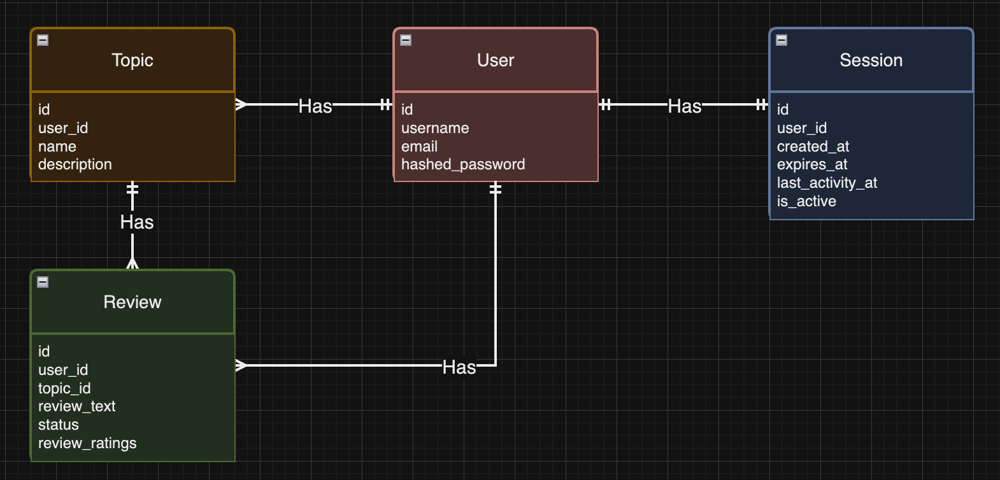

# Feedback Flow

## How to run:
- First run the following to install dependancies:
```
$ pip install -r requirements.txt
```
- navigate to the root directory `TEAM-PROJECT-TEAML/`
- then run the following command to start the server
```
$ python3 -m src.server.server_app
```
- Once the server is running you will have to register with a name, email, and password. Once registered you will log in and will be redirected to the logged in pages where you can create topics and reviews

- if you have error ModuleNotFoundError: No module named 'bottle' try re0intalling bottle using pip3. It was fixed on one team members computer using "sudo pip3 install bottle" to re-install bottle.

## Running Tests:
- navigate to the root directory `TEAM-PROJECT-TEAML/`
- then run the following command to run a test
```
$ python3 -m unittest test/<test_file_name.py>
```

## Database ERD Diagram

